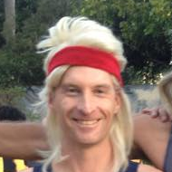
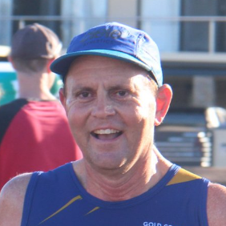
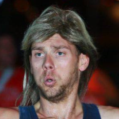
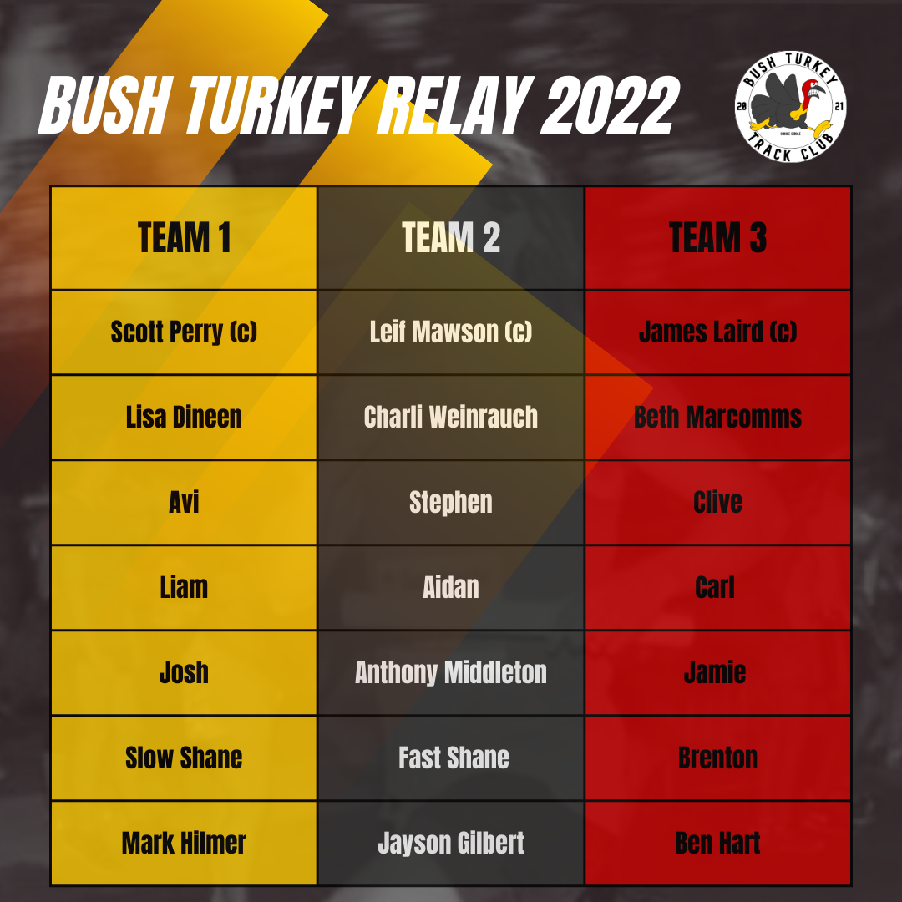

Bush Turkey Track Club brings you the most anticipated event of 2022.

Three teams of seven athletes each take on the 1km out and back course on the iconic Deagon Speedway, followed by a family friendly BBQ. $10 per adult, kids eat free.

Photos from the night are available on request, [message us on Instagram](https://www.instagram.com/bush_turkey_track_club/).

## Team captains

- **Leif Mawson**, Black Team
- **Scott Perry**, Yellow Team
- **James Laird**, Red Team

## Teams

